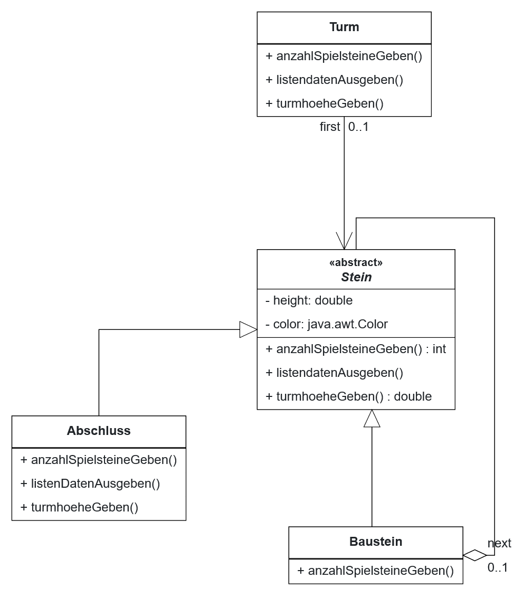

## Tower

### Aufgabenstellung (B.S. 31/4) 
1. Konstruieren Sie ein vollständiges Klassendiagramm unter Einbeziehung des Entwurfmusters Kompositum
2. Implementieren Sie folgende rekursiv definierten Methoden der TURM:
   1. Die Methode ```anzahlSpielsteineGeben```, die die Anzahl der Spielsteine (ohne Abschluss) zurückgibt
   2. Die Methode ```listendatenAusgeben```, die in einer Liste Farbe und Höhe aller Spielsteine des Turms ausgibt
   3. Die Methode ```turmhoeheGeben```, die die Gesamthoehe des Turms zurückgibt

### 1 - Klassendiagramm


